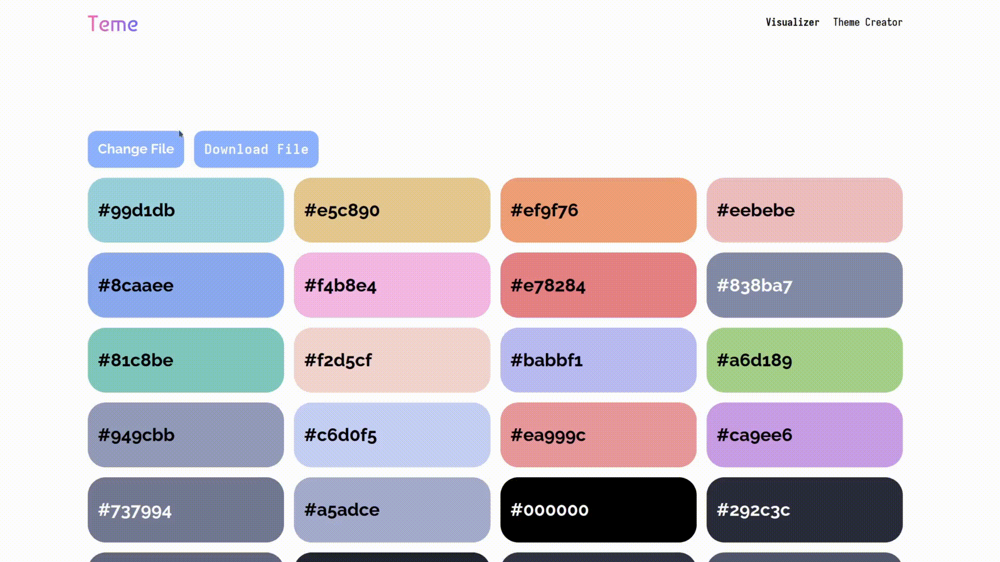
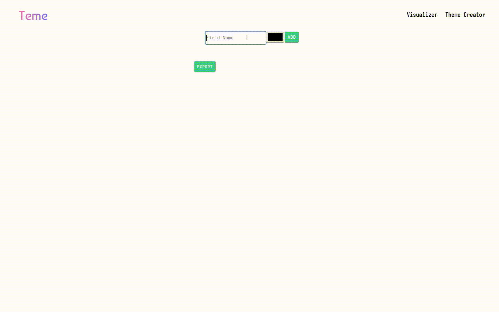

<p align="center"></p>

## Basic Overview

Teme is a web application designed for visualizing color themes through uploaded text files. It renders colors in HEX format, such as #2596be, within a grid layout on the webpage.


Colors can be individually customized and subsequently downloaded in the original format. Additionally, Teme provides a search function to locate all instances of a specific color in the uploaded file.



For creating new themes, Teme offers a user-friendly tool that facilitates theme generation and download in the preferred format.



## How to use

```bash
git clone https://github.com/Yordan0Vladov99/teme.git
cd theme_visualizer
npm install
npm run dev


```
